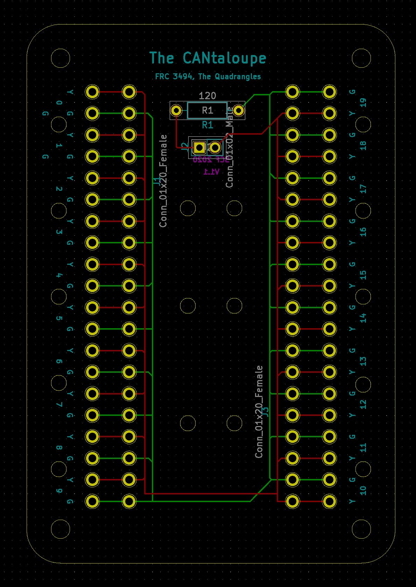

# Cantaloupe
Yet another star configuration CAN PCB for FRC

Cantaloupe is yet another PCB to enable an FRC CAN Bus to be laid out in a star topography. 
Cantaloupe was inspired partially by FRC 6502's board, [the CANTina](https://github.com/21brownz/CANtina)
* Cantaloupe utilizes Weidmuller LSF-SMT-3.5 push-to-connect terminal blocks to allow you to easily connect and disconnect devices.
* Cantaloupe has the capacity for up to 20 CAN devices simultaneousely.
* Cantaloupe has built in mounting holes for #4 screws, as well as holes intended for running zipties through to aid in cable management.
* Cantaloupe has a built in jumper, allowing you to choose whether or not to terminate the CAN Bus on the board.

## Warning:
Star topology can be very fussy. It violates the ISO 11898 standard and is not officially supported by any manufacturer. I do not officially condone the use of star configuration, nor do I accept any responsibility in the event that star can causes damage to one or more of your CAN devices. **Please be careful!**
